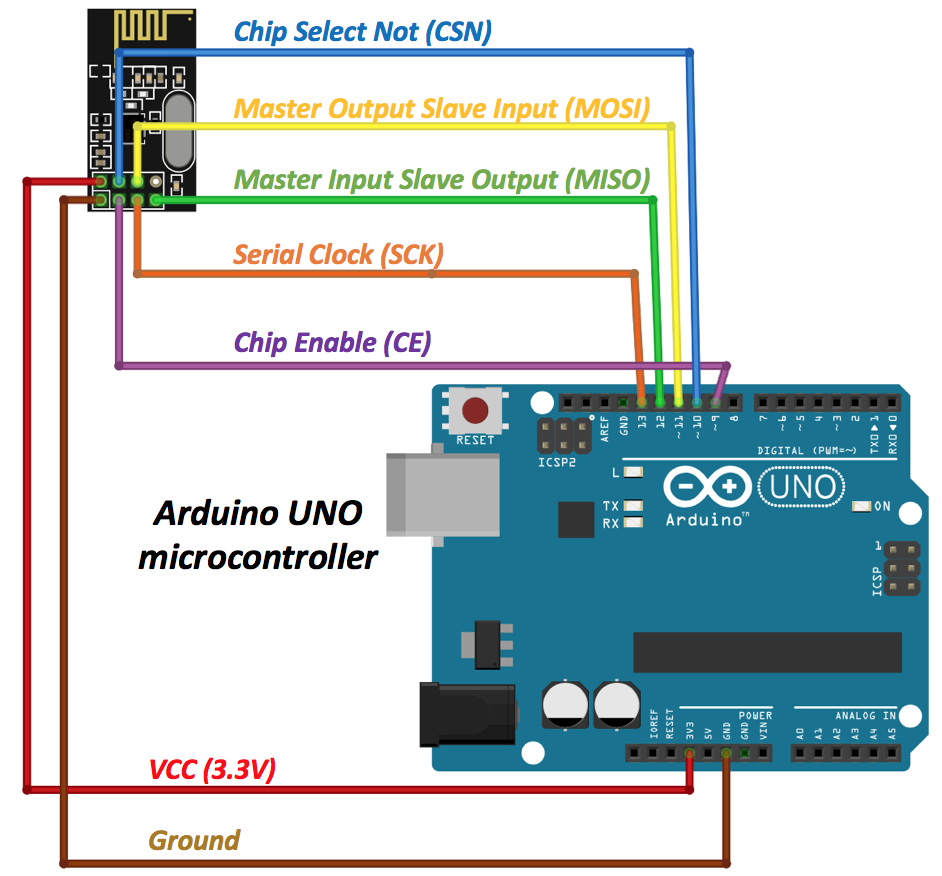
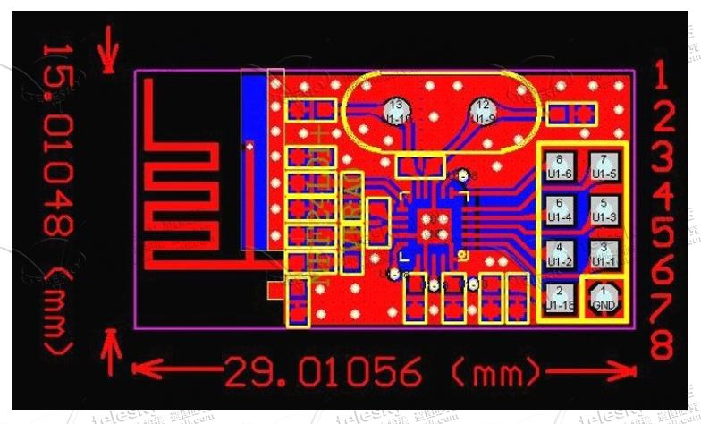

# programmable_sunshine
Programmable alarm clock with light bulb dimmer.

## Hardware - Bedside Module

| Hardware                | Use                 | Communication           |
| ----------------------- | ------------------- | ----------------------- |
| Push Button             | Light On/Off Toggle | Digital Pin             |
| Encoder / Rotary Button | Menu selection      | Digital Pin (Interrupt) |
| LCD Screen              | Menu                |                         |
| NRF24L01                | Radio               | SPI + 2 digital pins    |
| DS1307 Real Time Clock  | Clock               | **A4** and **A5** pins. |

 

## Hardware - Lightside Module

| Hardware                | Use                    | Communication           |
| ----------------------- | ---------------------- | ----------------------- |
| Encoder / Rotary Button | Light Dimmer Selection | Digital Pin (Interrupt) |
| NRF24L01                | Radio                  | SPI + 2 digital pins    |

## Wiring

### NRF24L01 - Bedside + Lightside  Module

| Pin on Radio Module | Pin on NRF24L01 Chip | Function                   | Arduino Pin |
| ------------------- | -------------------- | -------------------------- | ----------- |
| 1                   | GND                  | Ground (GND)               | 3V3         |
| 2                   | 18                   | 3.3V (VDD)                 | GND         |
| 3                   | 1                    | Chip Enable (CE)           | 9           |
| 4                   | 2                    | Chip Select NOT (CSN)      | 10          |
| 5                   | 3                    | Serial Clock (SCK)         | 13          |
| 6                   | 4                    | Master Out Slave In (MOSI) | 11          |
| 7                   | 5                    | Master In Slave Out (MISO) | 12          |
| 8                   | 6                    | IRQ                        | N/C         |

## Programming

### RTC (DS1307)

 https://learn.adafruit.com/adafruit-data-logger-shield/using-the-real-time-clock 

### Radio (NRF24L01)

#### **Radio communication protocol for the two devices**

1. **Bedside module** transmit a data frame containing a serial instruction to **Lightside module**. 

2. **Lightside module** reply with a acknowledgement frame. (Handled by the Library)

**Data frame**

Format: `D,[paylaod]/n`

Example: `D,1000/n`

Payload value range from `0` to `1000` from no output to 100% (220V) output

Address

#### Radio Setting

**Reference**

This tutorial is used: https://create.arduino.cc/projecthub/muhammad-aqib/nrf24l01-interfacing-with-arduino-wireless-communication-0c13d4 

This library is used:  https://github.com/nRF24/RF24 

The library reference is here:  http://tmrh20.github.io/RF24/classRF24.html 

**Code**

`02RadioExampleTest` is used to test the radio in good condition. The round trip delay is about 1800 microseconds when no retry is needed.

### Alarm Clock Programming

 https://create.arduino.cc/projecthub/Tittiamo/alarm-clock-f61bad 